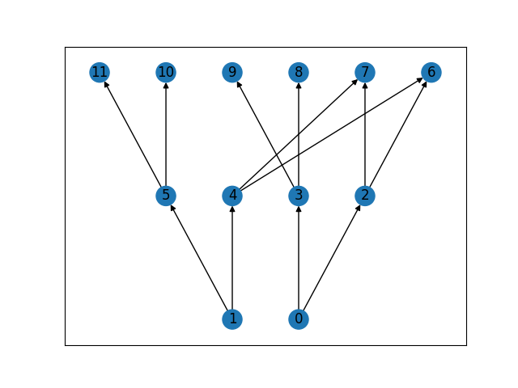
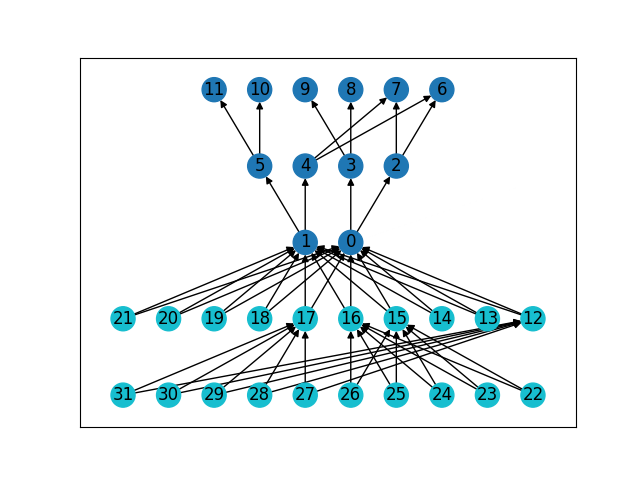

notesRealBreakpoints
================
2026-02-18

## Test data

Use `AlphaSimR_test/dev/multiple_chr.py` to simulate 2 chromosomes and 2
dip individuals with pedigree. Or directly use `msprime_chr0.trees` and
`msprime_chr1.trees` in `AlphaSimR_test/dev/testData`.

## Try this version

In this version, a recHistGen object (similar to recHist) was added to
record the real recombination breakpoints.

### Load tree sequences

    library(AlphaSimR)
    use_virtualenv("~/r-reticulate-env", required = TRUE)
    tskit <- import("tskit")
    devtools::load_all()

    # two chromosomes
    L1 <- 1e6
    L2 <- 2e6
    # here, use the same recombination map as used in msprime
    chr_info <- list(
      list(ts_path=".../AlphaSimR_test/dev/testData/msprime_chr0.trees",
           breaks=c(0, L1/2, L1), rates=c(1e-8, 2e-8), segSites=60),
      #breaks=c(0, L1/2, L1), rates=c(1e-5, 2e-5), segSites=60),
      list(ts_path=".../AlphaSimR_test/dev/testData/msprime_chr1.trees",
           breaks=c(0, L2/3, 2*L2/3, L2), rates=c(1e-7, 1e-8, 1e-7), segSites=155)
      #breaks=c(0, L2/3, 2*L2/3, L2), rates=c(1e-4, 1e-5, 1e-4), segSites=155)
    )

    founderGenomes1 <- asMapPop(chr_info = chr_info, inbred=FALSE, ploidy=2L)

### Run AlphaSimR

    set.seed(42)
    SP = SimParam$new(founderGenomes1)
    SP$setSexes("yes_sys")
    SP$addTraitA(nQtlPerChr = 5,
                 mean = 500,
                 var = 450)

    SP$setTrackPed(TRUE)
    # try the new function here, it automatically set setTrackRec also.
    SP$setTrackRecGen(TRUE)
    basePop = newPop(founderGenomes1)

    # the 2 objects are same now:
    SP$recHistGen
    SP$recHist

    basePop = setPheno(basePop,
                       h2 = 0.5)
                       
    #--- n generations
    nCycles<-2

    # very simple container for each cycles sim output
    simOutput<-list(basePop)
    cycle<-1
    for(cycle in 1:nCycles){
      cat(paste0(" C",cycle))
      # choose the best from last cycle
      chosenParents<- selectInd(pop=simOutput[[cycle]], nInd=6, use = "gv")
      # make crosses
      offspringPop<-randCross(pop=chosenParents, nCrosses=2, nProgeny = 5)
      # phenotype  new offspring
      offspringPop<-setPheno(pop = offspringPop, h2 = 0.5)
      # add new offspring to simOutput list
      simOutput[[cycle+1]]<-offspringPop
    }

Now we can see the difference between recHist and recHistGen:

    RHG <- SP$recHistGen
    RH <- SP$recHist
    # ind 3; chr 2; hap 1. Maybe not the same output, please check RHG and RH to find a hap with recombination
    rh <- RH[[3]][[2]][[1]]
    rhg <- RHG[[3]][[2]][[1]]
    gm <- SP$genMap[[2]]

Col 1: original Hap; Col2: start from where (recHist: index of SNP;
recHistGen: positions in Morgan)

    > rh
         [,1] [,2]
    [1,]    2    1
    [2,]    1  112
    > rhg
         [,1]       [,2]
    [1,]    2 0.00000000
    [2,]    1 0.09354741

So, if everything goes well, rh\[2,2\]-1 \< rhg\[2,2\] \< rh\[2,2\]. We
can check it with genMap (SNP index -\> SNP position in Morgan):

    > gm[[111]]
    [1] 0.0923321
    > gm[[112]]
    [1] 0.0939209

### Collect information for ts tables

    # for RecHist
    # bridgeSegDfList store the indexes of SNPs after recombination events
    bridgeCollectSegFromSimOutput(SP, simOutput)
    # for RecHistGen
    # bridgeSegDfListGen store the positions of where recombination happen
    bridgeCollectSegGenFromSimOutput(SP, simOutput)

For RecHist, the indexes of SNPs have to be turned into positions:

    edgeDf <- bridgeAllSegToEdgeDf(chr_info)

### Write tree files and check

    bridgeWriteTrees(chr_info, edgeDf, SP)

In python:

    import tskit
    origin = tskit.load('.../AlphaSimR_test/dev/testData/msprime_chr0.trees')
    marker_ts = tskit.load('.../AlphaSimR_test/dev/testData/AlphaSimR_extended_chr0.trees')

    # Statistics:
    # chr1
    origin.num_trees
    298
    marker_ts.num_trees
    298
    # chr 1 is too short for new recombination events. But 40 new nodes (2 x 20 ind) added.
    origin.num_nodes
    260
    marker_ts.num_nodes
    300

    # chr2
    origin = tskit.load('.../AlphaSimR_test/dev/testData/msprime_chr1.trees')
    marker_ts = tskit.load('.../AlphaSimR_test/dev/testData/AlphaSimR_extended_chr1.trees')
    # now here are new recombination events:
    origin.num_trees
    620
    marker_ts.num_trees
    623
    # and still 40 new nodes:
    origin.num_nodes
    491
    marker_ts.num_nodes
    531

We can plot the pedigree by (information in individual table):

    from matplotlib import pyplot as plt
    import networkx as nx
    import tskit
    def draw_pedigree(ped_ts):
        G = nx.DiGraph()
        for ind in ped_ts.individuals():
            time = ped_ts.node(ind.nodes[0]).time
            pop = ped_ts.node(ind.nodes[0]).population
            G.add_node(ind.id, time=time, population=pop)
            for p in ind.parents:
                if p != tskit.NULL:
                    G.add_edge(ind.id, p)
        pos = nx.multipartite_layout(G, subset_key="time", align="horizontal")
        colours = plt.rcParams['axes.prop_cycle'].by_key()['color']
        node_colours = [colours[node_attr["population"]] for node_attr in G.nodes.values()]
        nx.draw_networkx(G, pos, with_labels=True, node_color=node_colours)
        plt.show()

    draw_pedigree(origin)

The new individuals added:

    draw_pedigree(marker_ts)

For RecHistGen, the positions were stored in bridgeSegDfListGen and can
be directly used:

    bridgeWriteTrees(chr_info, do.call(rbind, bridgeSegDfListGen), SP)

### More recombinations?

Let’s use the same msprime .tree files, but set higher recombination
rates to see the difference between recHist and recHistGen when there
are double crossing over between 2 sampled SNPs.

    L1 <- 1e6
    L2 <- 2e6
    chr_info <- list(
      list(ts_path=".../AlphaSimR_test/dev/testData/msprime_chr0.trees",
           #breaks=c(0, L1/2, L1), rates=c(1e-8, 2e-8), segSites=60),
      breaks=c(0, L1/2, L1), rates=c(1e-5, 2e-5), segSites=60),
      list(ts_path=".../AlphaSimR_test/dev/testData/msprime_chr1.trees",
           #breaks=c(0, L2/3, 2*L2/3, L2), rates=c(1e-7, 1e-8, 1e-7), segSites=155)
      breaks=c(0, L2/3, 2*L2/3, L2), rates=c(1e-4, 1e-5, 1e-4), segSites=155)
    )

    founderGenomes2 <- asMapPop(chr_info = chr_info, inbred=FALSE, ploidy=2L)
    set.seed(42)
    SP2 = SimParam$new(founderGenomes2)
    SP2$setSexes("yes_sys")
    SP2$addTraitA(nQtlPerChr = 5,
                 mean = 500,
                 var = 450)

    SP2$setTrackPed(TRUE)
    # try the new function here, it automatically set setTrackRec also.
    SP2$setTrackRecGen(TRUE)
    basePop2 = newPop(founderGenomes2, simParam = SP2)
    basePop2 = setPheno(basePop2,
                       h2 = 0.5,
                       simParam = SP2)

    #--- n generations
    nCycles<-2

    # very simple container for each cycles sim output
    simOutput2<-list(basePop2)
    cycle<-1
    for(cycle in 1:nCycles){
      cat(paste0(" C",cycle))
      # choose the best from last cycle
      chosenParents<- selectInd(pop=simOutput2[[cycle]], nInd=6, use = "gv", simParam = SP2)
      # make crosses
      offspringPop<-randCross(pop=chosenParents, nCrosses=2, nProgeny = 5, simParam = SP2)
      # phenotype  new offspring
      offspringPop<-setPheno(pop = offspringPop, h2 = 0.5, simParam = SP2)
      # add new offspring to simOutput list
      simOutput2[[cycle+1]]<-offspringPop
    }

check ind 3; chr 1; hap 1:

    RHG <- SP2$recHistGen
    RH <- SP2$recHist
    gm <- SP2$genMap[[1]]

    rh <- RH[[3]][[1]][[1]]
    rhg <- RHG[[3]][[1]][[1]]

Now we can see 10 more recombination events in recHistGen:

    > rh
         [,1] [,2]
    [1,]    2    1
    [2,]    1    8
    [3,]    2   36
    [4,]    1   44
    [5,]    2   47
    [6,]    1   50
    [7,]    2   52
    > rhg
          [,1]      [,2]
     [1,]    2  0.000000
     [2,]    1  1.306539
     [3,]    2  2.243464
     [4,]    1  2.423857
     [5,]    2  2.608929
     [6,]    1  2.831431
     [7,]    2  4.993668
     [8,]    1  5.958832
     [9,]    2  6.238179
    [10,]    1  7.697307
    [11,]    2  7.882583
    [12,]    1  8.537422
    [13,]    2  9.214039
    [14,]    1  9.696815
    [15,]    2 10.348671
    [16,]    1 11.282477
    [17,]    2 12.080616

To see where the recombination events (between which SNPs) recorded in
recHistGen:

    > x  <- rhg[,2]
    > 
    > left  <- findInterval(x, gm)
    > right <- pmin(left + 1, length(gm))
    > 
    > out <- data.frame(
    +   x = x,
    +   left_i  = left,
    +   left_v  = gm[left],
    +   right_i = right,
    +   right_v = gm[right]
    + )
    > 
    > out
               x left_i   left_v right_i  right_v
    1   0.000000      1  0.00000       2  0.00609
    2   1.306539      7  1.06375       8  1.36458
    3   2.243464     10  1.77918      11  2.51330
    4   2.423857     10  1.77918      11  2.51330
    5   2.608929     12  2.57886      13  2.86640
    6   2.831431     12  2.57886      13  2.86640
    7   4.993668     35  4.64742      36  5.39801
    8   5.958832     38  5.73197      39  6.43739
    9   6.238179     38  5.73197      39  6.43739
    10  7.697307     41  7.61275      42  8.31825
    11  7.882583     41  7.61275      42  8.31825
    12  8.537422     43  8.51587      44  8.67657
    13  9.214039     46  8.85817      47  9.52313
    14  9.696815     47  9.52313      48 10.44305
    15 10.348671     47  9.52313      48 10.44305
    16 11.282477     49 10.92943      50 11.29281
    17 12.080616     51 11.94669      52 12.37887

The double crossing overs between 2 sampled SNPs (e.g. rows 3 & 4; 5 &
6; 8 & 9; 10 & 11; 14 & 15) were ignored by recHist but kept by
recHistGen.
